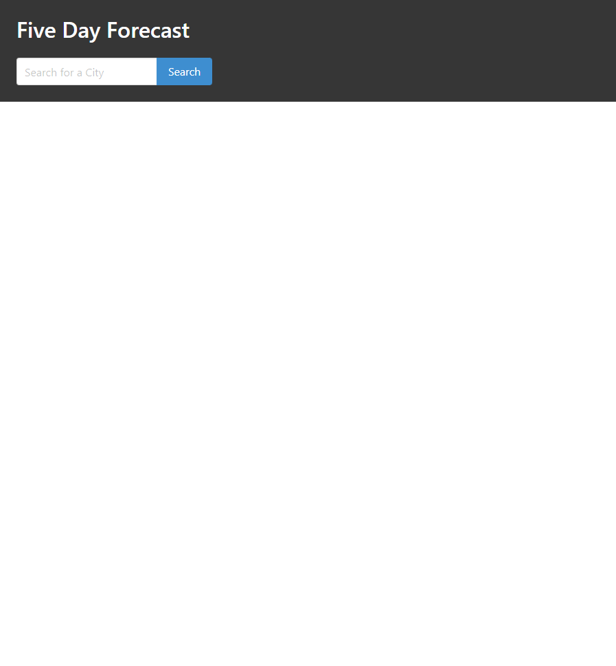

## five-day-forecast

# Description

I needed to create a website that would call the OpenWeather API and list a five day forecast of a city that was searched for

# Acceptance Criteria

Have a search bar to type in the name of a city.

The name of the city should be saved to the local storage search history.

The forecast should display the current day plus the next five days.

The forecast should include the temperature, a visual icon that represents the weather, the humidity and wind speed.

Clicking on the search history presents you with the present and future conditions for that city.

## Work Completed

Created a search bar.

# Website Link

https://iqwixn.github.io/five-day-forecast/

# Website screenshot

